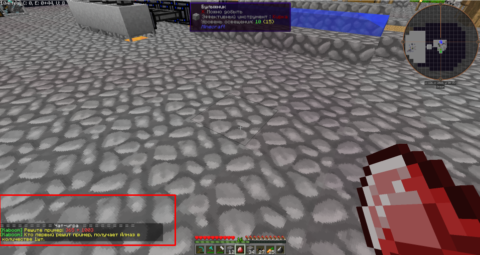
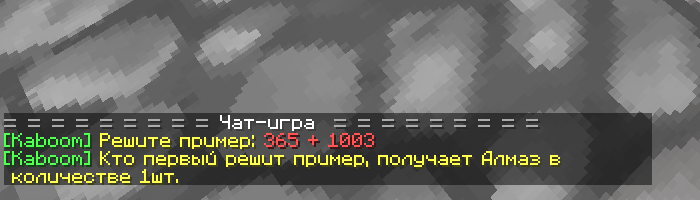
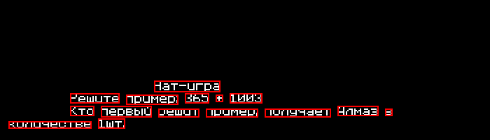

# Анализатор текста в чате игры Minecraft
## Описание

Анализатор создан на основе нейросети Tesseract OCR. Tesseract использует языковые модели, которые называются traineddata files. Эти файлы содержат данные, необходимые для распознавания текста на конкретных языках. Эти модели были обучены на специальных наборах данных, состоящих из изображений и соответствующего текстового содержимого.
## Горячие клавиши

- <kbd>Ctrl</kbd>+<kbd>Tab</kbd> - делает скриншот, пытается решить пример. если успешно решает, то сперва откроет игровой чат, после чего введет результат решения и отправит в чат.
- <kbd>Shift</kbd>+<kbd>Tab</kbd> - делает скриншот, пытается решить пример. если успешно решает, то сразу введет результат решения и отправит в чат.
- <kbd>Ctrl</kbd>+<kbd>q</kbd> - выход
## Как работает

При нажатии комбинации клавиш <kbd>Ctrl</kbd>+<kbd>Tab</kbd> программа делает скриншот и выделяет на нем область (выделена красным).

После чего скриншот обрезается.

 Желтый текст и красный меняется на белый и все цвета отличные от белого заменяются на черный.

После чего это изображение обрабатывает Tesseract OCR, используя traineddata из `traineddata/min.traineddata`. Данный файл может определять буквы верхнего и нижнего регистра а так же цифры. 